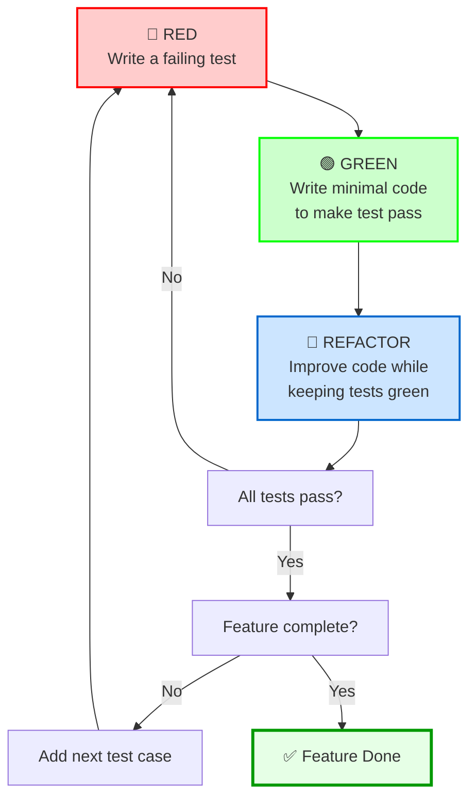

# 🍭 Sweet Shop Management System

A responsive, interactive web-based inventory management system for sweet shops. This frontend-only project was developed as part of the **Incubyte TDD Assessment** using **HTML**, **CSS**, and **JavaScript**.

---

## 📋 Project Overview

This system allows users to manage sweet shop products through an intuitive interface. It supports adding, searching, sorting, and filtering sweets based on their attributes like name, category, price, and quantity.

---

## 🚀 Features

- **Add Sweet**: Input fields for ID, name, category, price, and quantity
- **RenderAllSweet**: showing all sweets with fields and Values
- **Search**: Filter sweets by name or category in real-time
- **Sort**: Sort list by name, category, price, or quantity (asc/desc)
- **Validation**: Prevents invalid entries like negative numbers or empty fields
- **Dynamic UI**: Updates sweet list instantly on actions
- **Error Handling**: Displays clear messages on validation failure
- **Clean Design**: Uses CSS for layout and responsiveness

---

## 🛠️ Technologies Used

| Technology     | Purpose                        |
|----------------|--------------------------------|
| HTML           | Markup for layout              |
| CSS   | Styling and responsive design  |
| JavaScript     | Application logic and DOM      |

---
## 🔧 Prerequisites
- A modern web browser (Chrome, Firefox, Edge, etc.)

- A text editor (like VS Code) – for viewing/editing code

- Basic understanding of HTML, CSS, and JavaScript (optional, for understanding the logic)
---
## 📥 Installation & Setup
Step1. **Clone the repository**
   ```bash
   git clone https://github.com/rathodprakash-123/Incubyte-TDD-Assesment
   cd Incubyte-TDD-Assessment
   ```
-
Step2.**Locate the index.html file in the project folder.**

- **Run Application**

### Option 1: 

-    Double-click index.html to open it in yourdefault browser.

### Option 2 (Recommended): 
-    Use Live Server in VS Code:

-    Install Live Server extension in VS Code

-    Then right-click on index.html and select "Open with Live Server"
 -   Interact with the App

-    Add, search, sort, and manage sweet inventory using the intuitive UI.

## Testing

Step1.**install npm module for test**

    npm init
    npm npm install --save-dev 
**(option:2) Add a test script in package.json:**

    "scripts": {
    "test": "jest"
    }
Step2.**Run Test**

    npm test
## 🧪 Test Cases

The implementation includes comprehensive test cases covering:

✅Add Sweet	                           

✅Error on Duplicate Sweet ID	            

✅Delete Sweet Successfully	            

✅Error on Deleting Non-existent Sweet	

✅Search by Name	                        

✅Search by Category	                    

✅Search by Price Range	                

✅Sort by Price Ascending	                

✅Purchase Sweet & Reduce Stock	        

✅Error on Insufficient Stock Purchase	

✅Restock Sweet & Increase Quantity	    

✅Error on Restocking Non-existent Sweet	

## 💡 Usage Examples

const shop = new SweetShop();

- ### Add sweets

    shop.addSweet({ id: "1", name: "Rasgulla", category: "Bengali", price: 15, quantity: 50 });

    shop.addSweet({ id: "2", name: "Kaju Katli", category: "Dry Fruit", price: 25, quantity: 30 });

- ### Add duplicate sweet (throws error)

    shop.addSweet({ id: "1", name: "Gulab Jamun", category: "Bengali", price: 20, quantity: 40 });

    -  #### Throws: Error: Sweet with this ID already exists

- ### Delete a sweet

    shop.deleteSweet("2"); // Removes Kaju Katli

- ### Delete non-existent sweet (throws error)
    
    shop.deleteSweet("999");
    - #### Throws: Error: Sweet not found

- ### Search sweets

    shop.searchByName("rasgulla");     
    - #### Returns: [ { id: "1", name: "Rasgulla", ... } ]
    shop.searchByCategory("bengali");  
    - #### Returns: [ { id: "1", name: "Rasgulla", ... } ]
    shop.searchByPriceRange(10, 20);   
    - #### Returns: [ { id: "1", name: "Rasgulla", ... } ]

- ### Sort sweets
    shop.sortBy("price", "asc");       
    - #### Returns sweets sorted by price in ascending order
    shop.sortBy("quantity", "desc");   
    - #### Returns sweets sorted by quantity in descending order

- ### Purchase sweet
    shop.purchaseSweet("1", 10);       
    - #### Decreases quantity of Rasgulla by 10

 - Insufficient stock purchase (throws error)
    shop.purchaseSweet("1", 100);
    - #### Throws: Error: Not enough stock to complete the purchase

- ### Restock sweet
    shop.restockSweet("1", 20);        
    - #### Increases quantity by 20

    - Restock non-existent sweet (throws error)
        shop.restockSweet("999", 10);
        - #### Throws: Error: Sweet not found
        
## 🔍 TDD Approach

This project follows the Red-Green-Refactor cycle:



### TDD Cycle Breakdown:

1. **🔴 Red Phase**: Write a failing test
   - Define the expected behavior
   - Test should fail (no implementation yet)
   - Validates that the test can actually fail

2. **🟢 Green Phase**: Write minimal code to make the test pass
   - Implement just enough code to pass the test
   - Focus on functionality, not perfection
   - Get to green as quickly as possible

3. **🔵 Refactor Phase**: Improve the code while keeping tests green
   - Clean up the code
   - Remove duplication
   - Improve design and readability
   - Ensure all tests still pass

Each feature was implemented incrementally with tests written first, ensuring:
- Code correctness
- Design simplicity
- Comprehensive test coverage
- Maintainable codebase

## 🚦 Running the SweetShop

### Run Tests Only
```bash
npm test
```
## 🎯 Key Learning Outcomes
- **Test-Driven Development**: Practical application of TDD principles

- **JavaScript ES6+ Proficiency**: Used modern JavaScript features like classes, arrow functions, and array methods

- **DOM Manipulation**: Created dynamic, interactive UIs using event-driven JavaScript

- **Modular Code Design**: Maintained separation of concerns using class-based architecture (SweetShop)

- **Manual Unit Testing**: Wrote and executed structured test cases directly in the browser to validate functionality

- **Git Version Control**: Used Git for incremental development and version tracking

## 📝 Notes

- All tests are written manually in JavaScript and executed in the browser console

- No build tools or frameworks are used — this is a pure HTML/CSS/JS project

- The code follows JavaScript best practices and naming conventions

- Exception messages and errors are handled clearly for better debugging and user understanding

## 🎓 Assessment Context

- Understanding of TDD-inspired development in frontend JavaScript

- Proficiency in JavaScript ES6 features and browser-based application design

- Manual testing practices and validation of edge cases

- Clean code principles using modular class-based structure

- Problem-solving through real-world UI/UX use cases like sorting, filtering, and input validation

- Thoughtful design, responsive UI, and user-focused functionality

- Practical application of Git and GitHub for source control and project organization
## 📚 References & Acknowledgments
- This project is based on the Sweet Shop Management Kata, inspired by Test-Driven Development principles.
- It was developed as part of a technical assessment to demonstrate practical understanding of:

- Core JavaScript concepts

- Frontend application architecture

- Manual TDD approach

- Real-world problem solving

### Special Thanks:
- **Incubyte**: For providing this assessment opportunity
- **LDCE Ahmedabad**: For facilitating the campus placement drive
- **TDD Community**: For promoting best practices in software development

---
**Author**: Prakash Rathod

**Institution**: LDCE, Ahmedabad

**Purpose**: Incubyte Campus Placement Drive Assessment

